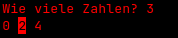

# Einführung -- Memory Management in C

Dieses Dokument ist eine Einführung für das Memory Management der
Programmiersprache C und richtet sich an Anfänger. Es erklärt die
Grundlagen des Umgangs mit Speicher, zeigt typische Fehlerquellen auf
und stellt wichtige Funktionen wie *malloc*, *free* und *realloc* vor..

## Was ist Memory Management?

Der grösste Unterschied zwischen C und vielen anderen
Programmiersprachen wie Python oder Java besteht darin, dass du in C das
**Memory Management selbst übernehmen** musst. In Sprachen wie Python
kümmert sich ein sogenannter **Garbage Collector** automatisch darum,
nicht mehr benötigten Speicher freizugeben. In C hingegen musst du den
Speicher **explizit reservieren und wieder freigeben**, sobald du ihn
nicht mehr brauchst.

Dadurch gehört C den wenigen Programmiersprachen, mit denen sich
Programme besonders **effizient und performant** gestalten lassen.
Vorausgesetzt, man beherrscht das Memory Management gut.

## 

## Hauptarten von Speicher

Hauptsächlich gibt es zwei arten von Speicherbereiche. Einmal den Stack
und einmal den Heap. Diese haben beide einen Unterschiedlichen
Einsatzzwecke

### Stack

-   Wird für **lokale Variablen** und **Funktionsaufrufe** verwendet
-   Speicher wird **automatisch** verwaltet (d.h. er wird beim Verlassen
    des Gültigkeitsbereichs freigegeben)
-   Sehr **schnell**, aber **limitiert** in der Grösse
-   Kein manuelles *free* nötig
-   Daten werden in einem festen LIFO-Prinzip (Last In, First Out)
    abgelegt

Beispiel:

int x = 5; // x wird auf dem Stack gespeichert

### Heap

-   Wird verwendet, wenn Speicher dynamisch zur Laufzeit benötigt wird
-   Speicher muss manuell reserviert (*malloc*, *calloc*) und
    freigegeben (*free*) werden
-   Langsamer als der Stack, aber flexibler und meist grösser
-   Eignet sich für Datenstrukturen wie Arrays, die zur Laufzeit wachsen
    sollen

Beispiel:

int\* ptr = (int\*) malloc(sizeof(int)); // ptr zeigt auf Speicher im
Heap

### Fazit:

  ----------------- -------------------------------------------- --------------
  Speicherbereich   Eigenschaften                                Beispiel
  Stack             Schnell, automatische verwaltung, begrenzt   Int x = 5;
  Heap              Flexibel, manuelle verwaltung, grösser       Malloc, free
  ----------------- -------------------------------------------- --------------

## Pointers die Grundlage des Memory Management

Bevor wir uns mit Funktionen wie *malloc *und *free *beschäftigen müssen
wir verstehen, wie **Pointer** in C funktionieren. Ohne Pointer ist
dynamisches Memory Management nicht möglich.

### Was ist ein Pointer?

Ein **Pointer** ist eine Variable, die die **Adresse** eines anderen
Werts im Speicher speichert.

int x = 10;

int\* ptr = &x; // ptr zeigt auf die Adresse von x

-   x ist eine normale ganzzahl mit dem wert 10
-   &x ist die Speicheradresse von x
-   *\*ptr* ist ein Pointer auf einen *int*. In diesem beispiel auf *x*

### Warum ist das so wichtig?

Ohne Pointer könnten wir:

-   keinen Speicher im Heap reservieren (z. B. mit *malloc*)
-   keine Daten in Funktionen verändern (nur Kopien)
-   **keine dynamischen Datenstrukturen **wie Listen, Bäume oder Arrays
    zu Laufzeit erstellenBeispiel: Wert über Pointer verändern

#include \<stdio.h\>

void quadriere(int\* zahl) {

\*zahl = (\*zahl) \* (\*zahl);

}

int main() {

int x = 4;

quadriere(&x);

printf(\"%d\\n\", x); // Ausgabe: 16

return 0;

}

-   quadriere bekommt einen **Pointer auf x**
-   \*zahl ist der Wert, also 4
-   Er wird quadriert und überschreibt den alten wert

### Pointer-Syntax

  --------------- -------------------------------------------------------------
  *int\* ptr*     Ein Pointer auf einen *int*
  *&x*            Die Adresse von *x*
  *\*ptr*         Der Wert an der Adresse, auf die *ptr* zeigt
  *ptr = NULL;*   Der Pointer zeigt auf nichts (wichtig zur Fehlervermeidung)
  --------------- -------------------------------------------------------------

### Häufige Fehler

  ------------------------------- --------------------------------------------------------
  **Uninitialisierter Pointer**   Zeigt auf zufälligen Speicher -- führt zu Absturz
  **Dereferenzierung von NULL**   Zugriff auf *\*ptr*, obwohl *ptr == NULL*
  **Use After Free**              Zugriff auf Speicher, der mit *free* freigegeben wurde
  ------------------------------- --------------------------------------------------------

### Faustregeln

-   Pointer **immer initialisieren **(z. B. mit *NULL)*
-   Nur auf Pointer zugreifen, wenn sie **gültig sind**
-   Nach *free(ptr); → ***immer *****ptr = NULL; *****setzen**

## Wichtige Funktionen

Diese Funktionen sind die zentralen Werkzeuge, wenn es darum geht, in C
dynamisch Speicher zu verwalten. Sie gehören zur Standardbibliothek
(*stdlib.h*) und arbeiten mit ****Pointers****.****

### *malloc* -- Speicher reservieren

int\* ptr = (int\*) malloc(sizeof(int));

#### Was macht *malloc*?

-   Malloc steht für **Memory Allocation**
-   Es reserviert einen **Block Speicher **im **Heap**, dessen Grösse du
    in Byte angibst (meist mit *sizeof(...)*)
-   Gibt einen Pointer auf den Anfang des reservierten Speicherbereichs
    zurück
-   Fall kein Speicher reserviert werden kann, gibt *malloc NULL*
    zurück.

#### Wichtige Hinweise

-   Der Inhalt des reservierten Speichers ist nicht initialisiert. Das
    heisst: Es kann beliebiger (Müll-)Wert drinstehen.
-   Du musst den Speicher **später selbst mit** *free()* **freigeben**,
    sonst entsteht ein **Memory Leak**.

#### Beispiel:

int\* zahlen = (int\*) malloc(10 \* sizeof(int)); // Speicher für 10
ints

if (zahlen == NULL) {

printf(\"Fehler: Speicher konnte nicht reserviert werden.\\n\");

}

### *calloc* -- Speicher reservieren und nullen

int\* ptr = (int\*) calloc(10, sizeof(int));

#### Was macht calloc?

-   *calloc* steht für **Contiguous Allocation** (zusammenhängende
    Zuweisung).
-   Es reserviert Speicher für meh**rere Elemente einer bestimmten
    Grösse.**
-   Im Gegensatz zu *malloc* wird **der gesamte reservierte Speicher mit
    0 initialisiert.**
-   Gibt, wie *malloc,*einen Zeiger auf den Anfang des Speicherbereichs
    zurück.

#### Unterschied zu *malloc*

  ------------ --------------------------- -------------------------------------------------------
  **malloc**   Nein (enthält Müllwerte)    Anzahl **in Bytes**
  **calloc**   Ja (auf Null)               **Anzahl der Elemente** und **Grö**ss**e je Element**
  ------------ --------------------------- -------------------------------------------------------

#### Wann *calloc *statt *malloc*?

Verwende **calloc**, wenn du sicherstellen willst, dass der Speicher
**vorbelegt mit Nullen** ist -- z. B. für:

-   Arrays, bei denen du alle Elemente standardmässig auf 0 setzen
    willst
-   Strukturen mit Pointern, die du explizit auf **NULL** haben willst
-   Sicherheitssensitive Daten (initiale Zustände)

### realloc -- Speichergrösse ändern

ptr = (int\*) realloc(ptr, neue_groesse_in_bytes);

#### Was macht *realloc*?

Verändert die Grösse eines bereits mit *malloc* oder *calloc*
reservierten Speicherbereichs.

Kann den Speicher **vergrössern oder verkleinern.**

Gibt einen neuen Zeiger zurück, da der Speicher an eine andere Adresse
verschoben werden kann.

Wenn die Vergrösserung nicht möglich ist, gibt *realloc* *NULL* zurück
der **ursprüngliche Pointer bleibt unverändert**, aber du verlierst ihn,
wenn du ihn nicht zwischenspeicherst.

#### Vorsicht

Wenn du den Rückgabewert direkt an denselben Zeiger zuweist und
*realloc* fehlschlägt, **verlierst du den alten Speicherblock** und
kannst ihn nicht mehr freigeben (Memory Leak!).

#### Beispiel:

int\* tmp = realloc(zahlen, 20 \* sizeof(int));

if (tmp != NULL) {

zahlen = tmp;

} else {

printf(\"Fehler: Speicher konnte nicht vergrössert werden.\\n\");

}

### free -- Speicher freigeben 

free(ptr);

ptr = NULL;

#### Was macht *free*?

-   Gibt den Speicher, der mit *malloc*, *calloc* oder *realloc*
    reserviert wurde, **wieder frei**.
-   Du musst *free* aufrufen, wenn du den Speicher nicht mehr brauchst.
-   Nach dem Aufruf zeigt der Zeiger auf **einen ungültigen Bereich**
    daher immer auf *NULL* setzen!

#### Fehler vermeiden:

  -------------------- -------------------------------------------------------
  Fehler               Erklärung
  Double Free          Speicher zweimal freigeben → kann zu Abstürzen führen
  Use After Free       Nach dem *free()* weiter auf den Speicher zugreifen
  Vergessenes *free*   Memory Leak, vor allem in Schleifen
  -------------------- -------------------------------------------------------

#### Beispiel:

free(zahlen);

zahlen = NULL; // schützt vor versehentlicher Nutzung

# Beispiel: Dynamic Array

Hier ist noch ein kleines beispiel, wie man die Heap memory verwenden
kann mit einem Dynamic Array:

#include \<stdio.h\>

#include \<stdlib.h\>

int main() {

int n;

printf(\"Wie viele Zahlen? \");

scanf(\"%d\", &n);

int\* zahlen = (int\*) malloc(n \* sizeof(int));

if (zahlen == NULL) {

printf(\"Speicher konnte nicht reserviert werden.\\n\");

return 1;

}

for (int i = 0; i \< n; i++) {

zahlen\[i\] = i \* 2;

}

for (int i = 0; i \< n; i++) {

printf(\"%d \", zahlen\[i\]);

}

printf(\"\\n\");

free(zahlen);

zahlen = NULL;

return 0;

}

Dieses kleine programm erstellt ein Array, dass so gross ist wie die
Zahl die du angibst im Terminal.

### {width="1.8535in" height="0.3957in"}Output

## Tipps

Immer ****prüfen****, ob **malloc**/**calloc** erfolgreich war (**!=
**NULL**).

-   Immer ******free****** verwenden, wenn Speicher nicht mehr gebraucht
    wird.

```{=html}
<!-- -->
```
-   Zeiger nach **free** ****auf ******NULL****** setzen****.

```{=html}
<!-- -->
```
-   Nutze lieber **calloc**, wenn du 0-initialisierte Daten brauchst.

```{=html}
<!-- -->
```
-   Verwende **realloc** ****vorsichtig****, da bei Fehler der
    ursprüngliche Zeiger verloren gehen kann.

## Fazit

Speicherverwaltung in C gibt dir ****viel Kontrolle****, aber auch
****viel Verantwortung****. Lerne früh, mit **malloc**, **free** & Co.
****sicher umzugehen.****
